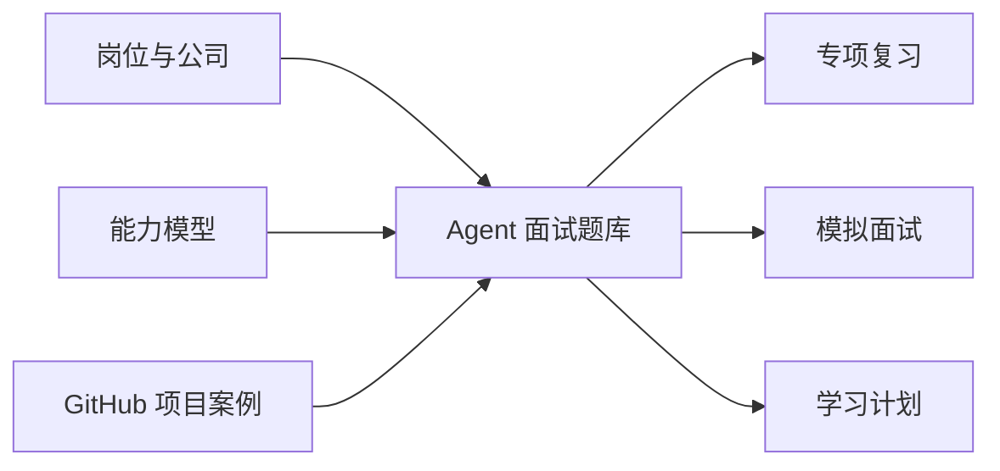

<div align="center">
  <h1>Agent Job Interview Roadmap</h1>
  <p><strong>面向 Agent 岗位的面试题库、能力地图、项目案例和学习路径。</strong></p>
  <p>
    <a href="https://harzva.github.io/agent-job-interview-roadmap/">在线题库</a>
    ·
    <a href="docs/">静态产物</a>
    ·
    <a href="public/data.json">题库数据</a>
  </p>
  <p>
    
    
    
    
  </p>
</div>

## 适合谁

这个仓库服务于正在准备 Agent / 大模型应用 / AI 工程岗位的人。它把岗位信息、能力模型、面试题和 GitHub 项目案例放在同一个网页里，方便按公司、按能力维度、按学习路径复盘。

| 人群 | 可以怎么用 |
| --- | --- |
| 求职者 | 按公司进入题库，准备 DeepSeek、华为、字节跳动、三星等方向 |
| 学习者 | 从通用能力、算法/RL、工程、数据、系统、产品、行为面试逐层补齐 |
| 项目实践者 | 参考 GitHub 案例，把题目训练和项目经历连接起来 |
| 面试官/导师 | 用能力模型组织模拟面试和训练计划 |

## 在线体验

| 入口 | 地址 | 用途 |
| --- | --- | --- |
| 在线题库 | <https://harzva.github.io/agent-job-interview-roadmap/> | 浏览题库、公司页和学习路径 |
| 数据文件 | [`public/data.json`](public/data.json) | 查看题库原始结构 |
| 发布目录 | [`docs/`](docs/) | GitHub Pages 使用的静态产物 |

## 内容结构



## 核心模块

| 模块 | 内容 |
| --- | --- |
| 公司专项 | DeepSeek、华为、字节跳动、三星等 Agent 岗位方向 |
| 通用题库 | 基础能力、算法/RL、工程、数据、系统、产品、行为面试 |
| GitHub 案例 | 可用于面试讲述和项目拆解的开源案例 |
| 学习路径 | 从岗位理解到项目准备的分阶段计划 |
| 交互体验 | HashRouter 单页应用，可直接部署在 GitHub Pages 子路径 |

## 本地运行

```powershell
npm install
node .\node_modules\typescript\bin\tsc -b
node .\node_modules\vite\bin\vite.js build
```

开发预览：

```powershell
node .\node_modules\vite\bin\vite.js --host 127.0.0.1 --port 3000
```

## 发布方式

GitHub Pages 使用 `main` 分支的 `/docs` 目录。更新流程：

```powershell
node .\node_modules\typescript\bin\tsc -b
node .\node_modules\vite\bin\vite.js build

# 将 dist/ 内容同步到 docs/
```

## 项目结构

```text
.
├─ docs/                # GitHub Pages 静态产物
├─ public/data.json     # 题库数据
├─ src/
│  ├─ pages/            # 首页、公司页、通用题库页
│  ├─ sections/         # 岗位、能力、面试、学习路径等区块
│  └─ components/       # 导航、Markdown 渲染、粒子背景等组件
├─ package.json
└─ vite.config.ts
```

## 维护说明

- 页面内容主要由 `public/data.json` 驱动。
- 当前仓库聚焦面试准备和学习导航，不承诺覆盖所有公司岗位。
- 题库和案例适合用于训练，不应替代真实岗位 JD 与最新招聘信息。
