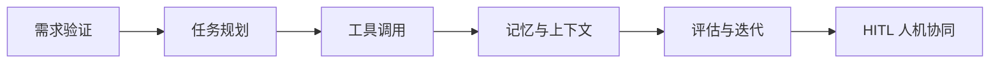

<div align="center">
  <h1>Agent Job Interview / Practice App</h1>
  <p><strong>统一仓库中的实战训练子应用：14 个 Agent 实战维度、647 道训练题，拆成可练习的路线图。</strong></p>
  <p>
    <a href="https://harzva.github.io/Agent-Job-Interview/practice/">在线练习</a>
    ·
    <a href="https://harzva.github.io/Agent-Job-Interview/">统一入口</a>
    ·
    <a href="public/topics.json">主题数据</a>
  </p>
  <p>
    
    
    
    
  </p>
</div>

## 这个站点解决什么问题

Agent 能力不是单一技术点，而是需求验证、任务分解、工具调用、记忆、评估、人机协同等多个维度的组合。本仓库把这些维度拆成可阅读、可抽题、可标记进度的练习站点。

| 你想做什么 | 推荐入口 |
| --- | --- |
| 系统学习 Agent 项目落地 | [在线练习](https://harzva.github.io/Agent-Job-Interview/practice/) |
| 随机抽题做模拟复盘 | 页面左侧「随机抽卡」模式 |
| 查看全部主题数据 | [`public/topics.json`](public/topics.json) |
| 修改或二次开发页面 | [`src/`](src/) |

## 学习地图



## 核心体验

| 功能 | 说明 |
| --- | --- |
| 专题学习 | 14 个 Agent 实战主题，按项目落地顺序组织 |
| 随机抽卡 | 从题库中抽取问题，用于模拟面试或每日训练 |
| 进度记录 | 在浏览器本地记录已完成题目 |
| 题目展开 | 支持逐题展开，避免一次性暴露全部答案思路 |
| 子路径部署 | 使用相对路径加载 `topics.json`，适配 GitHub Pages 项目页 |

## 数据概览

| 指标 | 数量 |
| --- | ---: |
| 实战主题 | 14 |
| 训练题 | 647 |
| 数据文件 | [`public/topics.json`](public/topics.json) |
| 发布目录 | [`docs/`](docs/) |

## 本地运行

```powershell
npm install
node .\node_modules\typescript\bin\tsc -b
node .\node_modules\vite\bin\vite.js build
```

开发预览：

```powershell
node .\node_modules\vite\bin\vite.js --host 127.0.0.1 --port 3000
```

## 发布方式

GitHub Pages 使用统一仓库 `main` 分支的 `/docs` 目录。更新页面时先构建，再把 `dist/` 同步到 `../../docs/practice/`。

> 数据加载使用 `./topics.json`，不要改成 `/topics.json`。项目页部署在 `/Agent-Job-Interview/practice/` 子路径下，根路径请求会导致页面停在“加载中”。

## 项目结构

```text
.
├─ ../../docs/practice/   # GitHub Pages 静态产物
├─ public/topics.json     # 14 个主题与题目数据
├─ src/
│  ├─ components/         # 侧边栏、专题页、抽题模式、进度条
│  ├─ pages/              # 首页入口
│  ├─ types/              # Topic 与题目类型
│  └─ App.tsx             # 数据加载与模式切换
├─ package.json
└─ vite.config.ts
```

## 维护说明

- 进度记录保存在浏览器 `localStorage`，不会上传到服务器。
- 题库用于学习和复盘，不代表官方 Kimi 面试题。
- 如果页面内容不显示，优先检查 `topics.json` 是否能在项目子路径下访问。
